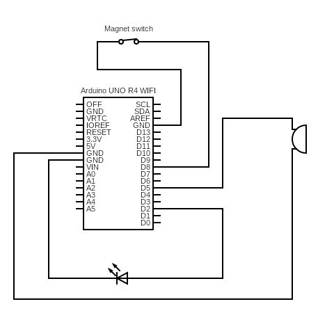

# Web controlled alarm

Alarm system controlled by web application build with Arduino UNO R4 WIFI.

## Features

Alarm that can be installed on doors or windows. Display for printing IP or web domain to connect to web application. LED and buzzer to signal that doors are open and password was not correctly inserted.

## Getting Started

### Requirements
<ul>
    <li>Arduino UNO R4 WIFI</li>
    <li>LED 5mm any color</li>
    <li>Resistor 220R</li>
    <li>Active buzzer 5V</li>
    <li>Any compatible magnet sensor on doors (I used Jablotron SA-203)</li>
    <li>Internet connection</li>
    <li>DuPont M-M, F-M cables</li>
</ul>

### Scheme



### Preparing code

In code you need to change ssid to name of your wifi and password of your wifi.

```
const char* ssid = "";
const char* password = "";
```

## Help
If you need anything from me about this application contact me at:
* pavel.halik06@gmail.com
